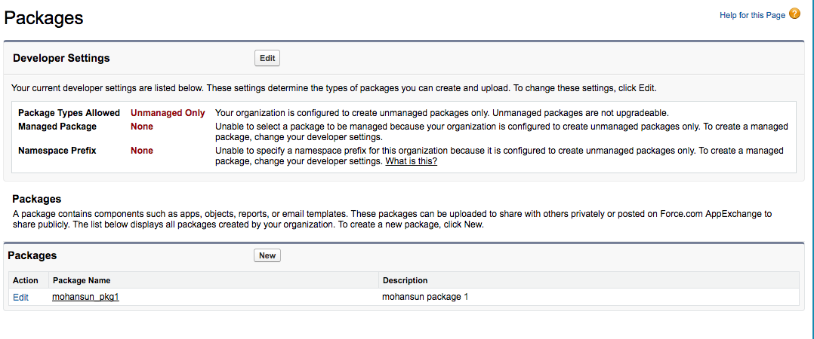
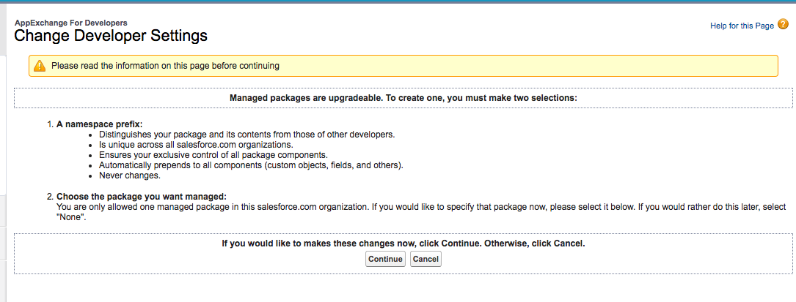
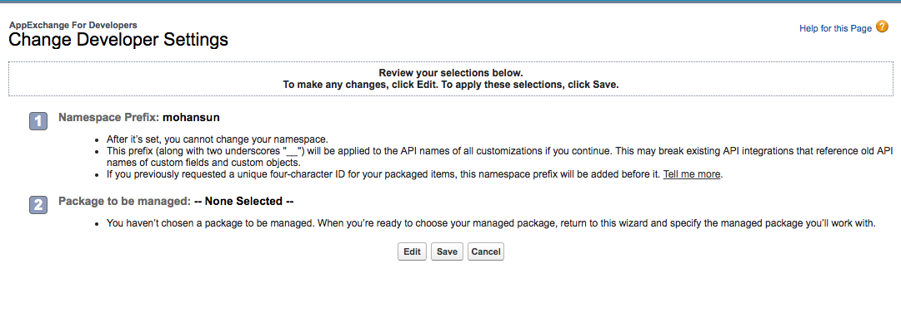
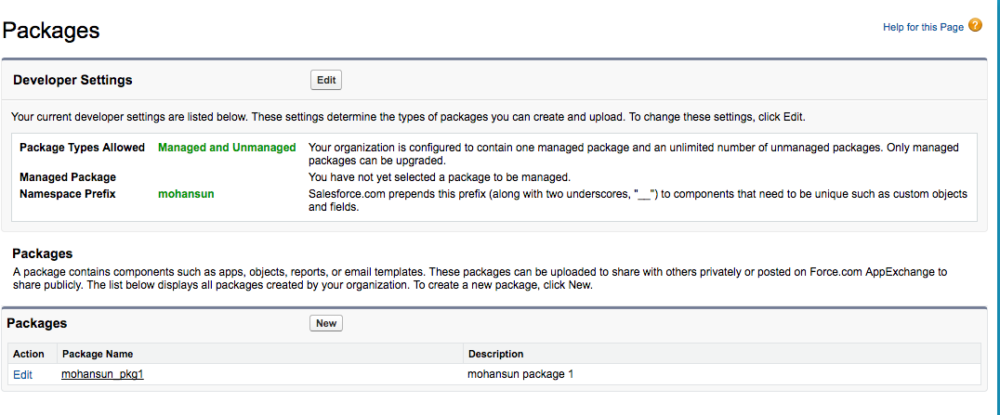
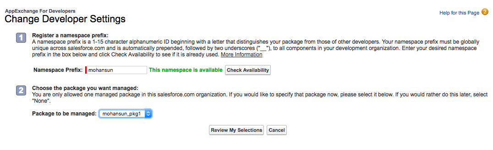

### How to setup namespace for your org


#### About namespace

Every component is part of a namespace.
This is used to group related components together


**Default** namespace is 'c'
Example:
```xml
   <c:adder/>
```

**Referring:**
Another component or application can reference a component
by adding
```xml  
    <myNamespace:myComponent/>
```
Example:
```xml
    <mohansun:adder/>
```

LX components from SFDC has namespaces:
 aura
 ui
 force

#### How to set namespace for your org:

A namespace prefix:
    Distinguishes your package and its contents from those of other developers.
    Is unique across all salesforce.com organizations.
    Ensures your exclusive control of all package components.
    Automatically prepends to all components (custom objects, fields, and others).
    Never changes.


### Example:
Setup > Packages :



Click on [Edit] to read the documentation about setting namespace






Click on [Edit] to to enter your namespace prefix and check for availability:



 Click on [Reveiew My Selections]:



### References

1. [Creating a Namespace in Your Organization ](https://developer.salesforce.com/docs/atlas.en-us.lightning.meta/lightning/namespaces_creating.htm)
